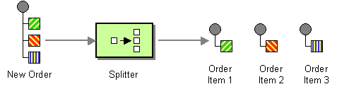

node-red-node-splitter
====================

This node iterates over an array.

This is a similar node to the 'function'-node, which allows custom javascript to be executed (in a sandbox).
This node will allow the enduser to use beautifull compact (sandboxed) splitter.

# The idea

In enterprise integration patterns there are many name for this: a splitter, sequencer, iterator or chunkifier.

In the end 'splitter' is the best name imho.
More info [here](http://www.enterpriseintegrationpatterns.com/Sequencer.html)

# Why a node?

Well..it looks more peacefull then this:

With visual progarmming the [Deutsch Limit](http://en.wikipedia.org/wiki/Deutsch_limit) seem to lure around every corner.

# Installation

Run: 

    npm install node-red-contrib-splitter

# Author

Leon van Kammen, http://coderofsalvation.github.io / http://github.com/coderofsalvation

# License 

GPL
